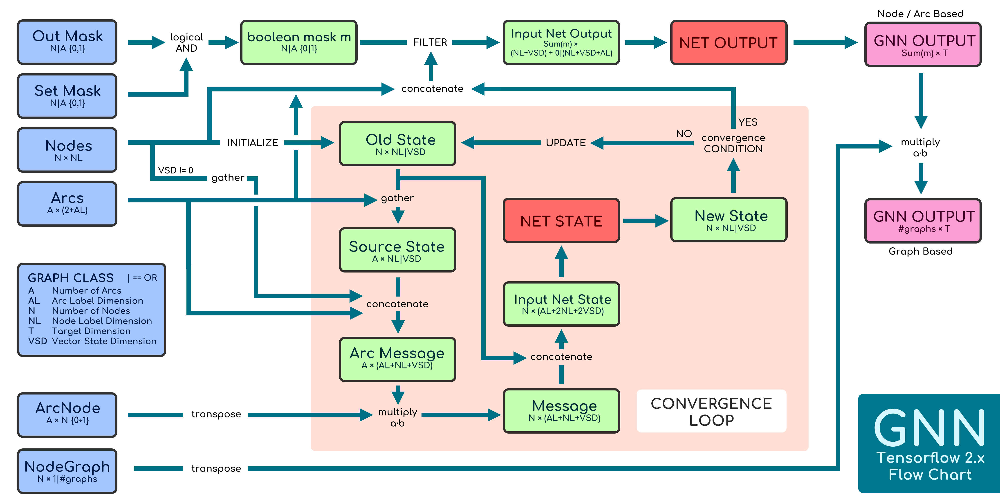

# GNN - Graph Neural Network Model - TF 2.x
This repo contains a Tensorflow 2.x implementation of the Graph Neural Network Model.

- **Authors:** [Niccolò Pancino](http://sailab.diism.unisi.it/people/niccolo-pancino/), [Pietro Bongini](http://sailab.diism.unisi.it/people/pietro-bongini/)

## Install
### Requirements
The GNN framework requires the packages **tensorflow**, **numpy**, **pandas**, **scikit-learn**, **matplotlib**.

To install the requirements you can use the following command:

    pip install -U -r requirements.txt

## Simple usage example
To train and test a GNN, simply run [starter.py](https://github.com/NickDrake117/GNN_tf_2.x/blob/main/starter.py):

    import starter

Open the script and set parameters in section *SCRIPT OPTIONS* to change script behaviour, then run it. 

By default both GNN training and GNN testing are performed.

In particular, `use_MUTAG = False` means that the GNN is trained on a dataset composed of graphs with random nodes/edges/targets.
Set `use_MUTAG = True` to train the GNN on the real-world dataset MUTAG for solving a graph-based problem ([details](https://github.com/NickDrake117/GNN_tf_2.x/blob/main/MUTAG_raw/Mutagenicity_label_readme.txt))

### GNN implementation flow chart
The following image details the GNN model as it is implemented in `GNN / GNN.py`.

## Citing
To cite the GNN implementation please use the following publication:

    Pancino, N., Rossi, A., Ciano, G., Giacomini, G., Bonechi, S., Andreini, P., Scarselli, F., Bianchini, M., Bongini, P. (2020),
    "Graph Neural Networks for the Prediction of Protein–Protein Interfaces",
    In ESANN 2020 proceedings (pp.127-132).
    
Bibtex:

    @inproceedings{Pancino2020PPI,
      title={Graph Neural Networks for the Prediction of Protein–Protein Interfaces},
      author={Niccolò Pancino, Alberto Rossi, Giorgio Ciano, Giorgia Giacomini, Simone Bonechi, Paolo Andreini, Franco Scarselli, Monica Bianchini, Pietro Bongini},
      booktitle={28th European Symposium on Artificial Neural Networks, Computational Intelligence and Machine Learning (online event)},
      pages={127-132},
      year={2020}
    }

---------

To cite GNN please use the following publication:

    F. Scarselli, M. Gori,  A. C. Tsoi, M. Hagenbuchner, G. Monfardini, 
    "The Graph Neural Network Model", IEEE Transactions on Neural Networks,
    vol. 20(1); p. 61-80, 2009.
    
Bibtex:

    @article{Scarselli2009TheGN,
      title={The Graph Neural Network Model},
      author={Franco Scarselli, Marco Gori, Ah Chung Tsoi, Markus Hagenbuchner, Gabriele Monfardini},
      journal={IEEE Transactions on Neural Networks},
      year={2009},
      volume={20},
      pages={61-80}
    }

## Contributions
Part of the code was inspired by [M. Tiezzi](http://sailab.diism.unisi.it/people/matteo-tiezzi/) and [A. Rossi](http://sailab.diism.unisi.it/people/alberto-rossi/) GNN implementation in TF 1.x ([repo](https://github.com/sailab-code/gnn)).

## License
Released under the 3-Clause BSD license (see `LICENSE.txt`):

    Copyright (C) 2004-2020 Niccolò Pancino
    Niccolò Pancino <niccolo.pancino@unifi.it>
    Pietro Bongini <pietro.bongini@gmail.com >
    Matteo Tiezzi <mtiezzi@diism.unisi.it>
